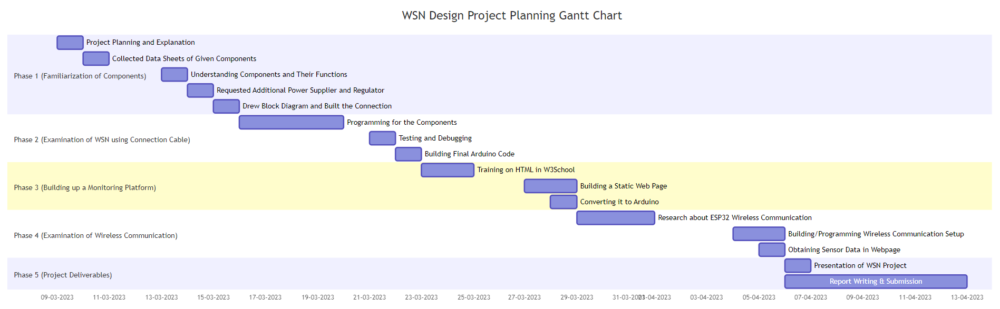
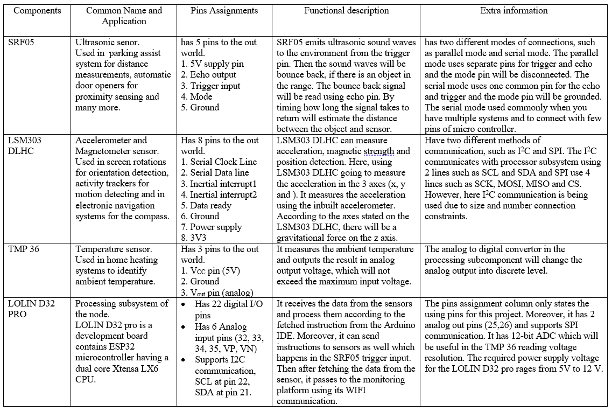
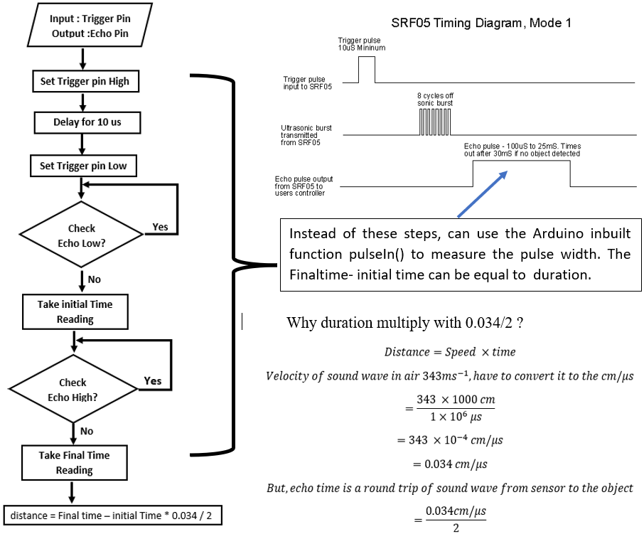
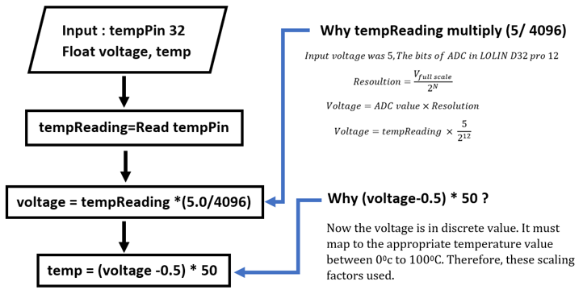
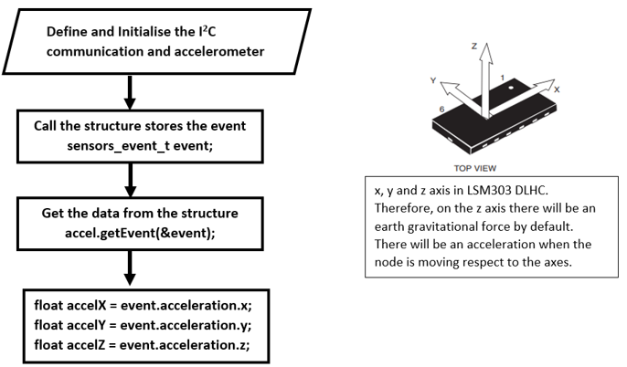

# Design_of_a_WSN

## 1. Introduction

The aim of this report is to describe the process of creating a wireless sensor node. To achieve this aim, several objectives need to be fulfilled, such as understanding the components being used in the node, building connections between the components in the node, ensuring the components functioning correctly, building a wireless network, transmitting data over the wireless network and monitoring them using user interface platform.

## 2. Background

To build this wireless sensor node, have received several electronic components such as an ultrasonic sensor (SRF05), temperature sensor (TMP 36), accelerometer sensor (LSM 303 DLHC), micro-controller (LOLIN D32 pro), voltage regulator (5V) and 9V battery. They can be classified into three main subsystems of a node such as sensing subsystem, processing subsystem and power subsystem. Moreover, it can mention the wires and breadboard of the node as a communication subsystem. Here, the aim is to build a wireless network. Therefore, needed a processing subsystem that can communicate wirelessly. It is the reason that LOLIN D32 Pro is being used here. It has Wi-Fi connectivity and Bluetooth connectivity.

To make this wireless network construction possible, tasks have been broken into four sub-tasks: familiarising with the components, examining WSN using connection cable, building a monitoring platform and examining wireless communication. Stage 1 is about learning the components’ functions and pin assignments. The second stage is working with the components using relative instructions with Arduino IDE, and the third stage is designing a webpage with the help of HTML and displaying sensor data. The final stage is building wireless communication using suitable network and MAC protocols. At the end of these stages, the project will achieve its aim of creating a wireless sensor node. The Figure 1 shows a Gannt chart showing the activities that took part in the assignment process.	

  

 Figure 1: Gantt chart of designing WSN. (self composed)
  

## 3. Methodology

### 3.1 Familiarisation of the Components

This is the first stage of this project. In this stage, the components are collected and relevant data sheets are obtained to identify components’ pins and functionalities. They are presented in the Table 1 under different rows describing each component’s function, pins and features.

 Table 1: System components’ pins and functionalities. (self composed) 

  

From, the Table 1, noticed that the sensing and processing components need a power supply. It must be portable due to the system’s wireless characteristic. Therefore, a 9V battery is utilised. However, the components only need a 5V supply only. Therefore, a 5V voltage LM7805 regulator was placed in the node. Otherwise, the components will damage due to overpower consumption.

### 3.2 Examination of WSN using a connection cable

In the earlier stage, have discussed the components’ characteristics and pins. With the aid of them, now must test the functionalities of each component using Arduino IDE. Therefore, first must check do they require any additional resources/ libraries. First, must start with processing subsystem of the node. The LOLIN D32 pro microcontroller need ESP32 library in the board manager to function. Therefore, the library downloaded and check it with the basic test code such as blink using high port number. After succeeding of processing subsystem, have to check the sensing subsystems of the node. The SRF05 and TMP36 modules does not require any additional library in Arduino. However, the LSM303 DLHC module requires, such as Adrafruit sensor library to access the data of the whole module, Adrafruit accelerometer library to access the accelerometer in the LSM303 DLHC module and Adrafruit BUS IO library for I2C communication. However, in the code, have used Wire.h library instead of the Adrafruit BUS IO library for the I2C communication. The declaring of these libraries in Arduino code is shown in the Appendix A(from line 3 to 5) , which shows the final code of this project. Now have to exam the process of each component.

#### 3.2.1 Ultrasonic Sensor (SRF05)

As discussed in the Table 1, the SRF05 emits the sound wave from trigger and echo pin receives the bounce back signal. The time took to bounce back is used to find the distance between the object and sensor with the aid of the velocity of sound in air. The process of finding time is shown in the Figure 2 as a flow chart, with relevant mathematical justifications to the calculation. (Kiani, W.by H., 2021)

 Figure 2: Ultrasonic sensor function flow chart. (self composed)
  

#### 3.2.2 Temperature sensor (TMP36)

TMP 36 reads the ambient temperature in analog. It must be converted into a discrete value. Finally, it must be map to the appropriate temperate level in oC. The conversion into discrete will be happened with the 12-bit ADC converter of the processing subsystem. The sequential flow of reading temperature is shown in the Figure 3 with appropriate justifications. (Last Minute Engineers, 2021)

 Figure 3: Temperature Reading flow chart. (self composed)
  

#### 3.2.3 Accelerometer (LSM303 DLHC)

The acceleration can directly read from the LSM303 DLHC sensor. There is no need to do any conversion or calculations. Just must know only the approach of reading from sensors. It is shown in the Figure 4 flow chart.

 

 Figure 4: Acceleration Reading flow chart. (self composed)
  