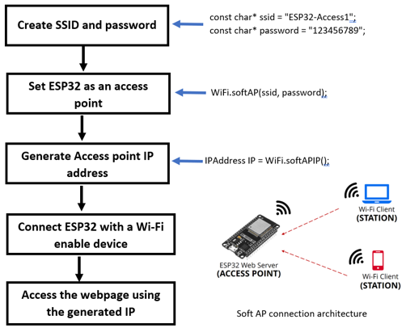

# Design_of_a_WSN

## 1. Introduction

The aim of this report is to describe the process of creating a wireless sensor node. To achieve this aim, several objectives need to be fulfilled, such as understanding the components being used in the node, building connections between the components in the node, ensuring the components functioning correctly, building a wireless network, transmitting data over the wireless network and monitoring them using user interface platform.

## 2. Background

To build this wireless sensor node, have received several electronic components such as an ultrasonic sensor (SRF05), temperature sensor (TMP 36), accelerometer sensor (LSM 303 DLHC), micro-controller (LOLIN D32 pro), voltage regulator (5V) and 9V battery. They can be classified into three main subsystems of a node such as sensing subsystem, processing subsystem and power subsystem. Moreover, it can mention the wires and breadboard of the node as a communication subsystem. Here, the aim is to build a wireless network. Therefore, needed a processing subsystem that can communicate wirelessly. It is the reason that LOLIN D32 Pro is being used here. It has Wi-Fi connectivity and Bluetooth connectivity.

To make this wireless network construction possible, tasks have been broken into four sub-tasks: familiarising with the components, examining WSN using connection cable, building a monitoring platform and examining wireless communication. Stage 1 is about learning the components’ functions and pin assignments. The second stage is working with the components using relative instructions with Arduino IDE, and the third stage is designing a webpage with the help of HTML and displaying sensor data. The final stage is building wireless communication using suitable network and MAC protocols. At the end of these stages, the project will achieve its aim of creating a wireless sensor node. The Figure 1 shows a Gannt chart showing the activities that took part in the assignment process.	

  

 Figure 1: Gantt chart of designing WSN. (self composed)
  

## 3. Methodology

### 3.1 Familiarisation of the Components

This is the first stage of this project. In this stage, the components are collected and relevant data sheets are obtained to identify components’ pins and functionalities. They are presented in the Table 1 under different rows describing each component’s function, pins and features.

 Table 1: System components’ pins and functionalities. (self composed) 

  

From, the Table 1, noticed that the sensing and processing components need a power supply. It must be portable due to the system’s wireless characteristic. Therefore, a 9V battery is utilised. However, the components only need a 5V supply only. Therefore, a 5V voltage LM7805 regulator was placed in the node. Otherwise, the components will damage due to overpower consumption.

### 3.2 Examination of WSN using a connection cable

In the earlier stage, have discussed the components’ characteristics and pins. With the aid of them, now must test the functionalities of each component using Arduino IDE. Therefore, first must check do they require any additional resources/ libraries. First, must start with processing subsystem of the node. The LOLIN D32 pro microcontroller need ESP32 library in the board manager to function. Therefore, the library downloaded and check it with the basic test code such as blink using high port number. After succeeding of processing subsystem, have to check the sensing subsystems of the node. The SRF05 and TMP36 modules does not require any additional library in Arduino. However, the LSM303 DLHC module requires, such as Adrafruit sensor library to access the data of the whole module, Adrafruit accelerometer library to access the accelerometer in the LSM303 DLHC module and Adrafruit BUS IO library for I2C communication. However, in the code, have used Wire.h library instead of the Adrafruit BUS IO library for the I2C communication. The declaring of these libraries in Arduino code is shown in the Appendix A(from line 3 to 5) , which shows the final code of this project. Now have to exam the process of each component.

#### 3.2.1 Ultrasonic Sensor (SRF05)

As discussed in the Table 1, the SRF05 emits the sound wave from trigger and echo pin receives the bounce back signal. The time took to bounce back is used to find the distance between the object and sensor with the aid of the velocity of sound in air. The process of finding time is shown in the Figure 2 as a flow chart, with relevant mathematical justifications to the calculation. (Kiani, W.by H., 2021)

 Figure 2: Ultrasonic sensor function flow chart. (self composed)
  

#### 3.2.2 Temperature sensor (TMP36)

TMP 36 reads the ambient temperature in analog. It must be converted into a discrete value. Finally, it must be map to the appropriate temperate level in oC. The conversion into discrete will be happened with the 12-bit ADC converter of the processing subsystem. The sequential flow of reading temperature is shown in the Figure 3 with appropriate justifications. (Last Minute Engineers, 2021)

 Figure 3: Temperature Reading flow chart. (self composed)
  

#### 3.2.3 Accelerometer (LSM303 DLHC)

The acceleration can directly read from the LSM303 DLHC sensor. There is no need to do any conversion or calculations. Just must know only the approach of reading from sensors. It is shown in the Figure 4 flow chart.

 

 Figure 4: Acceleration Reading flow chart. (self composed)
  

### 3.3 Building a monitoring platform

This is the third stage of this project. In here, have to build a webpage, where can monitor the information retrieved from the sensors after the processing. To develop a webpage, Hyper Text Markup Language(HTML) is used. Here as the first step developed a webpage using non-sensing data with the aid of w3schools, as shown in the Figure 5.

 

 Figure 5: Webpage developed using non sensing data in w3schools . (self composed)
  

Figure 5 on the left-hand side it shows the html code and on the right-hand side shows the result of html. However, our concern is to bring the Arduino data to this webpage instead of the non-sensing data.

### 3.4 Examination of WSN using wireless communication

The ESP 32 has a Wi-Fi and Bluetooth feature. Here, the Wi-Fi is being used. It means going to use the IEEE802.11 MAC protocol. To access this feature, need an additional library, it is the WiFi.h. It provides wireless connection and communication. Then, regarding to the instructor’s requirements the system is created as an access point. It means connecting directly with other Wi-Fi enable devices without using an additional physical router. Therefore, it is called as soft access point (Soft AP). (Last Minute Engineers, 2022) The steps for generating the ESP 32 as soft AP are shown in the Figure 6 flow chart.

The setup of wireless is done. Now have to pass the processed information to the client devices as a web page showing the results. For that, the network protocol used here is the HTTP (Hypertext Transfer Protocol). It is an application layer protocol used to transmit HTML, image and document files. The webpage going to transmit here must be accurate and dynamic. To pass a webpage, need another library called WebServer.h. It handles web services. The process of fetching information to a webpage is shown in the Figure 7 flow chart. In that, on the second process (handle root()), the above-designed HTML webpage code will be passed as a string. In the final stage of handling root, the server.send( 200, “text/html”, HTML) is coded saying if the connection was successful between the client and ESP 32 access point, it should pass the HTML text coded in the handle root as an HTML format to create a webpage. (Ramirez, R., 2021)

 

 Figure 6: Flow chart of creating ESP 32 as an access point. (self composed)
  

 

 Figure 7: Flow chart of passing information to Webpage. (self composed)
  

## 4. Results

### 4.1 Familiarisation of the Components

As according to the discussion in 3.1, first constructed a block diagram showing the connection between all subcomponents in the node. It is show in the Figure 8.

 

 Figure 8: Block diagram of WSN design. (self composed)
  

Then, have to build the connections between each part in physical. In the initial did not use any additional power supply, just consumed the power from the LOLIN D32 pro. It shows some error values which are not reliable. Then get to know the power supply was not enough, afterwards connected a 9v battery along with 5V regulator and observed it shows reliable values in Arduino. The connection made between system components are show in the Figure 9.

 

 Figure 9: Interconnections of components in the node. (self composed)
  

### 4.2 Examination of WSN using a connection cable

#### 4.2.1 Ultrasonic Sensor (SRF05) Arduino coding

From the above discussions and methodology from 3.2.1 section, an Arduino code is developed. It is simple, just want to know the process of how to determine the distance which showed in the Figure 2. With the aid of that, the developed Arduino code and its results on serial monitor is shown in the Figure 10.

 

 Figure 10: Arduino Coding for Ultrasonic sensor. (self composed)
  

#### 4.2.2 Temperature sensor (TMP36) Arduino coding

With the aid of findings and methodology of TMP 36, Arduino Code is developed shown in the Figure 11. In the initial time, TMP 36 did not provide correct reading because of wrong bit numbers of analog digital converter in LOLIN D32 pro. Then managed, to get to know that bit of ADC in LOLIN D32 pro is 12 and after doing some alteration in scaling factors managed to get proper reading of TMP 36 sensor. To ensure, reading it was compared with the home thermostat and they show nearly same reading. They have been shown in the Figure 11 as well.

 

 Figure 11: Arduino Coding for TMP36. (self composed)
  

#### 4.2.3 Accelerometer sensor (LSM303 DLHC) Arduino coding

The LSM303 DLHC required additional resources and structure to read the acceleration data. The starting was a bit tedious comparing other sensors. However, afterward, its reading process was too simple. The Arduino coding for LSM303 DLHC and the results printed in serial monitor is shown in the Figure 12. However, this coding can be further developed as a location finder for the node by finding the coordinate of each axis. This can be done by integrating the acceleration twice. Finally, it outputs the node’s position in X, Y and Z coordinates. It is shown in Appendix B but not fetched to the final WSN implementation. The reason not used in the final implementation is the frequent change of coordinates with significant differences in the wireless communication. It might be the effect of time calculation being used for it.

 

 Figure 12: Arduino Coding for LSM303 DLHC. (self composed)
  

### 4.3 Examination of WSN using wireless communication

After building the above codes and setting up the wireless connection developed the final code for the WSN. It is shown in Appendix A, along with the required libraries, sensor coding and server functions. As a result, the ESP32 started acting as a soft AP. The soft AP generated a unique IP address and utilising the IP address, was able to monitor the sensor values in a monitoring platform that connects to Wi-Fi-enabled devices. This process is illustrated in the Figure 13.

 

 Figure 13: Arduino Coding and wireless communication results. (self composed)
  

## 5. Conclusion

In conclusion, have built a local sensor node using the SRF05 module to find the distance, TMP 36 to find the ambient temperature and LSM303 DLHC to find acceleration utilized in the device with the help of core processing subsystem, LOLIN D32 Pro, then formed a wireless network using IEEE802.11 MAC protocol of LOLIN D32 Pro and transmitted data to other device using HTTP application protocol to monitor the reading in the webpage from a specific location. These processes gave a great depth of understanding for an engineering student of how wireless networks are formed, data transmission happens and the integration of sensor technologies. Moreover, by creating these WSNs, the node/ system can be placed in vulnerable/ desired locations and can observe wanted information. For example, the created WSN with more powerful features can place near the car windshield and, using a mobile device, can monitor the acceleration used in the car, the ambient temperature, and the distance between the car and the opposite/ front vehicles.

## 6. Reference

Kiani, W.by H. (2021) Getting started with ultrasonic module SRF05 and Arduino, Electropeak.
Available at: https://electropeak.com/learn/getting-started-with-ultrasonic-module-and-arduino/ (Accessed: 15 March 2023).

Last Minute Engineers (2022) In-depth: Create a simple ESP32 web server in Arduino Ide, Last
Minute Engineers. Available at : https://lastminuteengineers.com/creating-esp32-web-server-arduino-ide/ (Accessed: 24 March 2023).

Last Minute Engineers (2021) In-depth: Interfacing TMP36 temperature sensor with Arduino,
Last Minute Engineers. Available at: https://lastminuteengineers.com/tmp36-temperature-sensor-arduino-tutorial/ (Accessed: 14 March 2023).

Ramirez, R. (2021) How to show Arduino Sensor Data on a webpage, Circuit Basic. Available 
at: https://www.circuitbasics.com/how-to-set-up-a-web-server-using-arduino-and-esp8266-01/ 
(Accessed: 23 March 2023).
